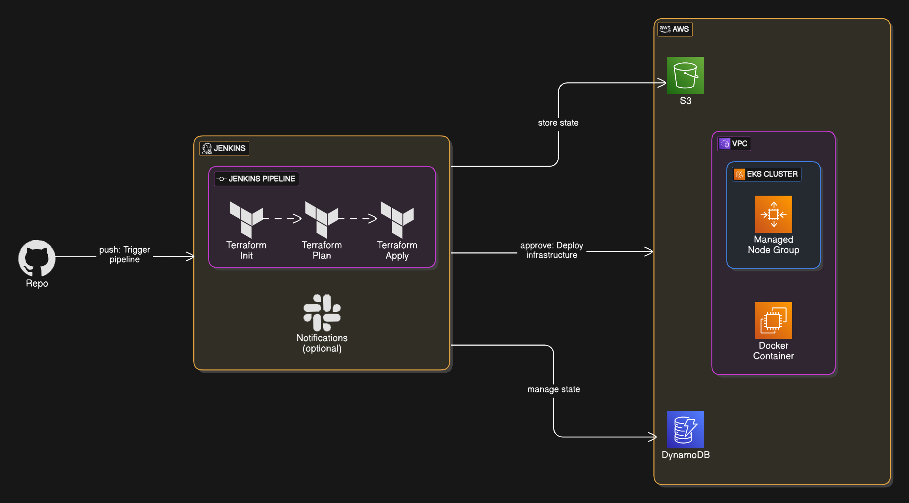

# Terraform AWS Infrastructure Demo


## Overview

Infrastructure as Code (IaC) using Terraform to provision AWS resources with modular design and CI/CD integration.



### Key Features

- VPC with public/private subnets
- EC2 instance with Docker container
- EKS cluster with managed node groups
- Security groups for access control
- S3 and DynamoDB for state management
- Jenkins pipeline
  - infrastructure deployment
  - Slack notifications (optional)

## Prerequisites

1. AWS CLI configured with administrative access
2. Terraform 1.5+ installed
3. Jenkins server with Docker plugin

## Project Structure

```bash
.
├── assets/                # Diagrams and other assets
├── modules/               # Reusable modules
│   ├── vpc/               # Network resources
│   ├── ec2/               # Compute resources
│   ├── eks/               # Kubernetes cluster
│   └── security-group/    # Security groups
├── dev/                   # Development environment
├── scripts/               # Utility scripts
├── Jenkinsfile            # CI/CD pipeline
├── README.md              # Documentation
└── .gitignore             # Git ignore file
```

## Getting Started

### 1. Setup AWS Prerequisites

```bash
# Run setup script (creates S3 bucket, DynamoDB, key pair)
chmod +x scripts/setup_prerequisites.sh
./scripts/setup_prerequisites.sh
```

### 2. Deploy Infrastructure

## Manual Deployment

```bash
# Navigate to dev environment directory
cd dev

# Initialize Terraform
terraform init

# Review execution plan
terraform plan

# Apply configuration
terraform apply
```

## CI/CD Pipeline

1. Configure Jenkins with:
   - AWS credentials (Secret text)
2. Create multibranch pipeline pointing to this repository
3. Pipeline stages:
   - AWS credentials setup
   - Terraform init/plan/apply with approval
4. Post-build actions:
   - Clean workspace
   - Notify Slack (optional)

### 3. Access Resources

- EC2 instance Public IP and EKS cluster endpoint is outputted
- EC2 Instance: `terraform output ec2_public_ip`
- EKS Cluster:

    ```bash
    aws eks --region eu-west-1 update-kubeconfig --name demo-eks
    kubectl get nodes
    ```

## Cleanup

For workspace cleanup in Jenkins, uncomment post-build action to clean workspace after build.

For manual cleanup:

```bash
# Destroy Terraform resources
cd dev
terraform destroy
```

For AWS prerequisites cleanup:

```bash
# Remove AWS prerequisites
chmod +x scripts/teardown_prerequisites.sh
./scripts/teardown_prerequisites.sh
```

## Security Considerations

- Rotate AWS credentials regularly
- Restrict security group ingress rules
- Enable EKS control plane logging
- Use IAM roles with least privilege

## Troubleshooting

### Common Issues

1. **Terraform state locking**
   - Verify DynamoDB table permissions
   - Use `terraform force-unlock` if needed

2. **EKS access**
   - Run `aws eks update-kubeconfig --region eu-west-1 --name demo-eks`

3. **Jenkins pipeline**
   - Check AWS credentials in Jenkins
   - Review pipeline logs

## Customization

- Adjust AWS region in `dev/variables.tf`, or create a `terraform.tfvars` if necessary
